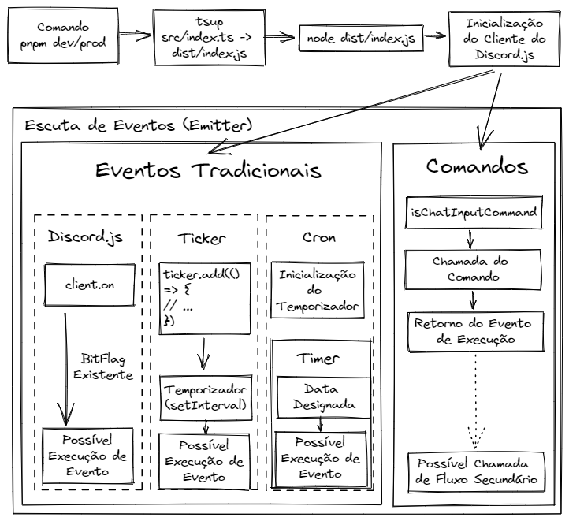

# He4rt Discord Bot Contributing Guide

### Requirements

- [discord.js Guide](https://discordjs.guide/#before-you-begin)
- [discord.js Docs](https://discord.js.org/)
- [GIT](https://git-scm.com/)
- [Conventional Commits](https://www.conventionalcommits.org/en/v1.0.0/)
- [Node 16.18.1](https://nodejs.org/en/)
- [PNPM](https://pnpm.io/pt/)

### Run

```
cp .env.example .env
```

```bash
pnpm install

pnpm dev
// OR
pnpm production
```

> ATENÇÃO! Caso use o comando `pnpm dev` e dê algum erro, aperte `Ctrl + S` em um arquivo `.ts` para ele recompilar a aplicação.

### Deploy

```bash
// set version, set git tag, generate CHANGELOG.md and push
pnpm version:(patch|minor|major)
```

### Commit Guideline

No geral, serão considerados válidos os commits que seguem a base do [Conventional Commits](https://www.conventionalcommits.org/en/v1.0.0/).

## #Pull Request Guideline

No geral, serão considerados válidos PR's detalhados e de fácil compreensão.

### Structure

```
.
├── client                       # Anexos para o cliente padrão do `discord.js`
├── commands                     # Comandos do BOT
├── defines                      # Definições
├── events                       # Eventos temporizados, sequenciais e do discord.js
├── http                         # Base para as requisições HTTP
| global.d.ts                    # Tipos do NodeJS e derivados
| index.ts                       # Ponto de partida para a inicialização do BOT
| main.ts                        # Criação do cliente do `discord.js`
| types.ts                       # Tipagem
| utils.ts                       # Funções para uso genérico em outros arquivos
```

## Flux Dev/Prod


